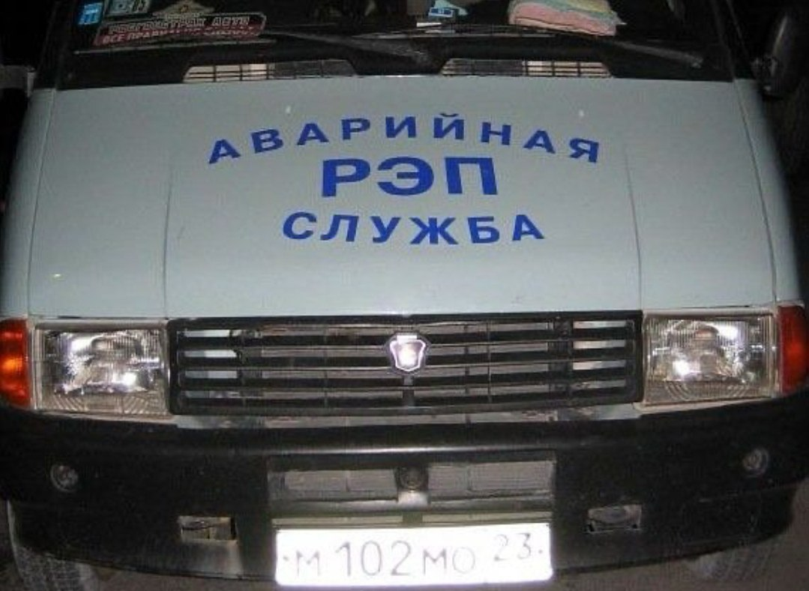

# `I AM MUSIC`

  
### Information Science and Computing Technology 

### C, C++, Python, HTML, Arduino developer

#

   
   
   
   
   

## Horses don't stop, they keep going

<table align="center"><tbody><tr border="none"><td width="30%" align="center">

</td><td width="30%" align="center">
</td></tr></tbody></table>

-----

<picture>

</picture>

